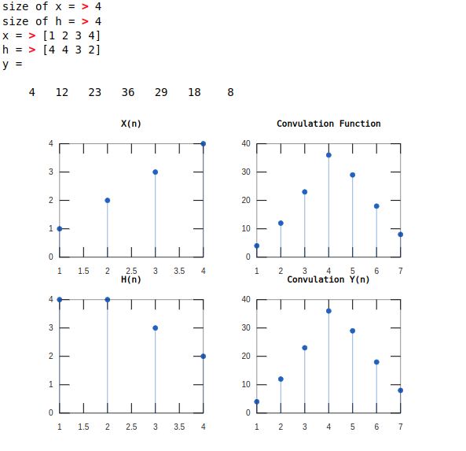

<!-- <script type="text/javascript" src="http://cdn.mathjax.org/mathjax/latest/MathJax.js?config=TeX-AMS-MML_HTMLorMML"></script>
<script type="text/x-mathjax-config"> MathJax.Hub.Config({ tex2jax: {inlineMath: [['$', '$']]}, messageStyle: "none" });</script> -->
<div style="text-align: justify">

**Experiment No:** 02

**Experiment Name:** 
Study of convolution of two signals using matlab.

**Experiment Date:** 19 - 03 - 23

**Theory:**

Convolution is a mathematical operation on two functions (f and g) to produce a third function that expresses how the shape of one is modified by the other. The term convolution refers to both the result function and to the process of computing it. It is defined as the integral of the product of the two functions after one is reversed and shifted. The integral is evaluated for all values of shift, producing the convolution function.

**Code:**
```m
xsize = input('size of x = ');
hsize = input('size of h = ');
n = xsize + hsize - 1;
x = input('x = ')
h = input('h = ')

y = zeros(1, n);

for i = 1:xsize
    j = 1; k = i;
    while j <= xsize && k > 0
        y(i) = y(i) +  (x(j) * h(k));
        j = j + 1; k = k - 1;
    end
end

for i = 1 : hsize - 1
    j = i + 1; k = hsize;
    while j <= xsize && k > 0
        y(i + xsize) = y(i + xsize) +  (x(j) * h(k));
        j = j + 1; k = k - 1;
    end
end
y

subplot(2, 2, 1); stem(x, 'marker', 'o');
title('X(n)');
subplot(2, 2, 3); stem(h, 'marker', 'o');
title('H(n)');
subplot(2, 2, 2); stem(conv(x, h), 'marker', 'o');
title('Convulation Function');
subplot(2, 2, 4); stem(y, 'marker', 'o');
title('Convulation Y(n)');
```

\
**Output:**



<center> Fig. 1: Output of convolution of two signals. </center>

<!-- <div style="text-align: justify"> -->

**Discussion:**

In this experiment, we have studied the convolution of two signals using matlab. We have taken two signals x and h and convolved them to get the output signal y. We have also plotted the graph of the signals x, h, y and the convulation function. The output of the program is shown in Fig. 1.


</div>
