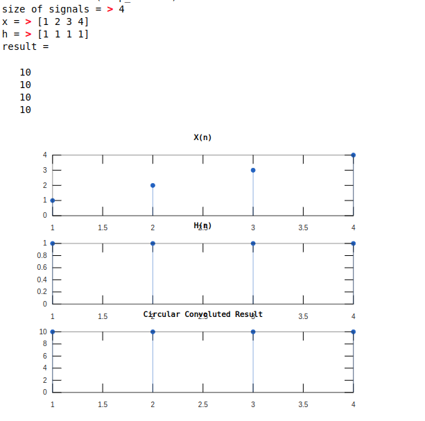
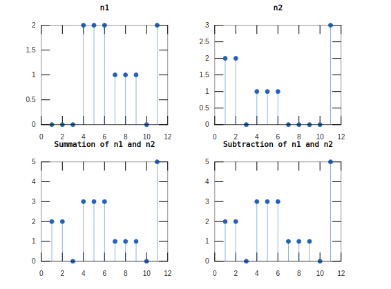

<script type="text/javascript" src="http://cdn.mathjax.org/mathjax/latest/MathJax.js?config=TeX-AMS-MML_HTMLorMML"></script>
<script type="text/x-mathjax-config"> MathJax.Hub.Config({ tex2jax: {inlineMath: [['$', '$']]}, messageStyle: "none" });</script>
<div style="text-align: justify">

**Experiment No:** 03

**Experiment Date:** 03 - 04 - 23

**Experiment Name:** 

1. Circular Convolution of two signals.
2. Plotting two given signals and their summation and subtraction.
3. Drawing two given signals in one figure

**Theory:**

Circular convolution is a special case of periodic convolution, which is the convolution of two periodic functions that have the same period. Circular convolution arises most often in the context of fast convolution with a fast Fourier transform (FFT) algorithm. In this case, circular convolution (which corresponds to the product of two polynomials whose coefficients are the values of the samples) must be used to compute the convolution sum. The circular convolution of two finite-length sequences is defined by cyclically shifting (rotating) one of them so that both sequences are aligned at the first sample and then calculating the linear convolution of the aligned sequences. 

**Code 1:**
```m
size = input('size of signals = ');
x = input('x = ');
h = input('h = ');
xmat = zeros(size, size);
hmat = zeros(size, 1);
for i = 1:size
   hmat(i, 1) = h(i);
end

for i = 1:size
    for j = 1:size
        xmat(j, i) = x(j);
    end
    y = x(size);
    for j = size:-1:2
        x(j) = x(j - 1);
    end
    x(1) = y;
end

result = xmat * hmat
subplot(3, 1, 1); stem(x, 'marker', '.'); title('X(n)');
subplot(3, 1, 2); stem(h, 'marker', '.'); title('H(n)');
subplot(3, 1, 3); stem(result, 'marker', '.'); title('Circular Convoluted Result');
```


\
\
\
**Output 1:**



<center> Fig. 1: Output of convolution of two signals. </center>

**Code 2:**
```m
t = 0:0.1:11;
n1 = [0, 0, 0, 2, 2, 2, 1, 1 ,1, 0, 2];
n2 = [2, 2, 0, 1, 1, 1, 0, 0, 0, 0, 3];
sum = n1 + n2;
sub = n1 + n2;
subplot(2, 2, 1); stem(n1, 'marker', '.'); title('n1');
subplot(2, 2, 2); stem(n2, 'marker', '.'); title('n2');
subplot(2, 2, 3); stem(sum, 'marker', '.'); title('Summation of n1 and n2');
subplot(2, 2, 4); stem(sub, 'marker', '.'); title('Subtraction of n1 and n2');
```

**Output 2:**



<center> Fig. 2: Output of summation and subtraction of two signals. </center>

**Code 3:**
```m
a = [0 5 25 33];
b = [0 3 3 0];
%area(a, b); title("Graph 1");

hold on

c = [0 3 6 10 20 25 29 32];
d = [0 1 1 2 2 1 1 0];
area(a, b);
area(c, d); title("Graph");

hold off
```

\
\
\
\
\
\
\
\
\
\
**Output 3:**


<center> Fig. 3: Output of two signals in one figure. </center>


**Discussion:**

In this experiment, we have learned about circular convolution of two signals. We have also learned about plotting two signals and their summation and subtraction. We have also learned about plotting two signals in one figure.


</div>
