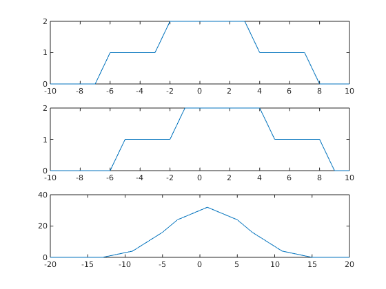

<!-- <script type="text/javascript" src="http://cdn.mathjax.org/mathjax/latest/MathJax.js?config=TeX-AMS-MML_HTMLorMML"></script>
<script type="text/x-mathjax-config"> MathJax.Hub.Config({ tex2jax: {inlineMath: [['$', '$']]}, messageStyle: "none" });</script> -->

**Experiment No:** 05

**Experiment Date:** 15 - 05 - 23

**Experiment Name:** Finding delay of signal by correlation.

**Theory:**
<div style="text-align: justify"> 
Correlation is a statistical measure that indicates the extent to which two or more variables fluctuate together. A positive correlation indicates the extent to which those variables increase or decrease in parallel; a negative correlation indicates the extent to which one variable increases as the other decreases. Correlation coefficients are expressed as values between -1 and 1. A coefficient of 1 indicates a perfect positive correlation. A coefficient of -1 indicates a perfect negative correlation. A coefficient of 0 indicates that there is no relationship between the different variables. In this experiment, we have studied about auto correlation and cross correlation. Auto correlation is the correlation of a signal with itself. Cross correlation is the correlation of two different signals. 
</div>

\
**Code:**
```m
t = -10:1:10;
x1 = (t >= -2 & t < 4);
x2 = (t >= -6 & t < 8);
x = x1 + x2;

d1 = (t >= -1 & t < 5);
d2 = (t >= -5 & t < 9);
d = d1 + d2;

corr = xcorr(d, x);
t2 = -20:1:20;
subplot(3, 1, 1); plot(t,x);
subplot(3, 1, 2); plot(t, d);
subplot(3, 1, 3); plot(t2,corr);

dd = 1;
for i = 1:length(corr)
    if corr(dd) < corr(i)
        dd = i;
    end
end
```

<!-- <div class="page"/> -->

**Output:**



<center> Fig. 1: Output of delay </center>

<!-- <div class="page"/> -->

\
**Discussion:**
<div style="text-align: justify">
In this experiment, we have found the delay of a signal by cross correlation. We have taken two signals and found the cross correlation of them. Then we have found the maximum value of the cross correlation. The index of the maximum value is the delay of the signal. We have found the delay of the signal is 1. 


</div>
